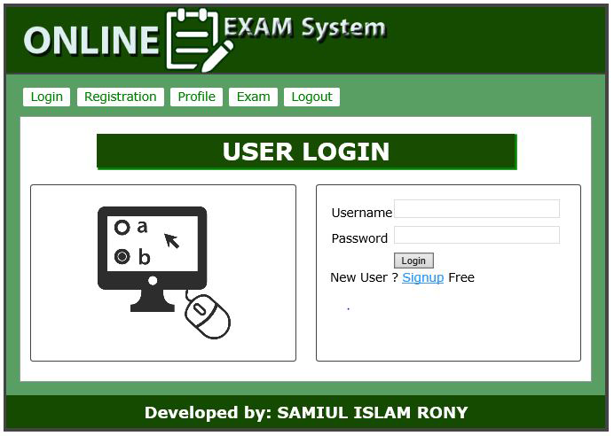

# Online Examination System
WEB based Online Examination System/Application using HTML, CSS, PHP, MySQLi, jQuery, Ajax and OOP (Object Oriented Programming) Concept

##User Interface with Step by Step Processing

